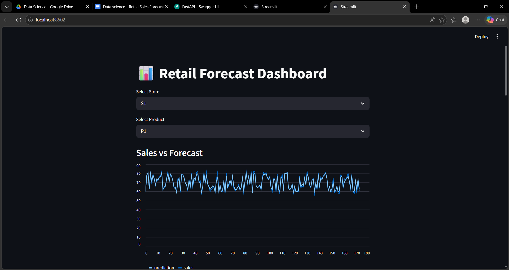
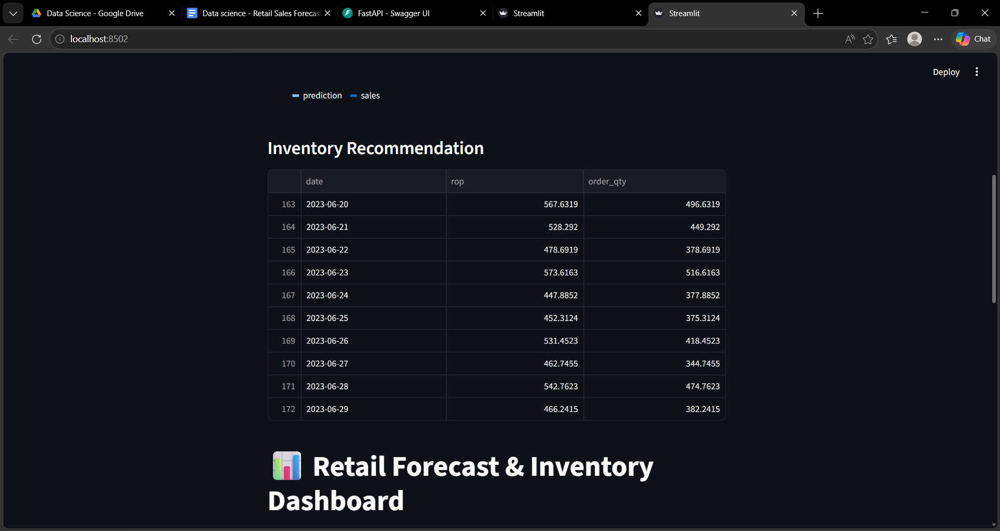
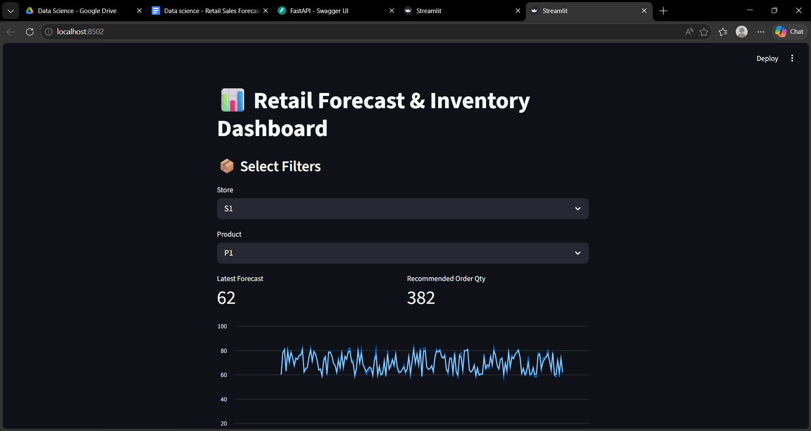
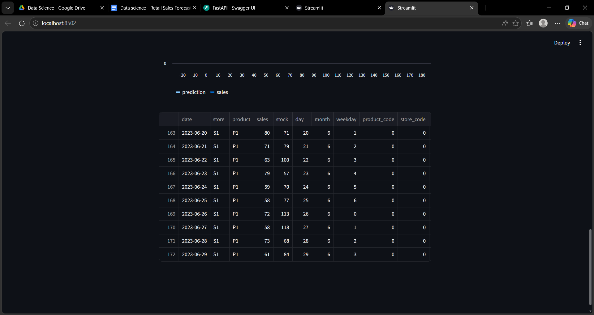
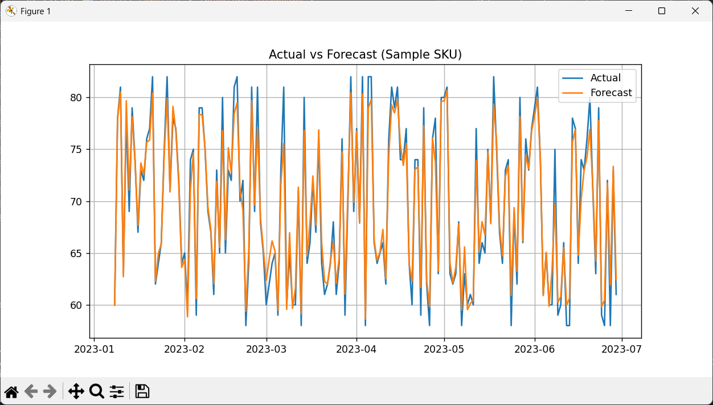
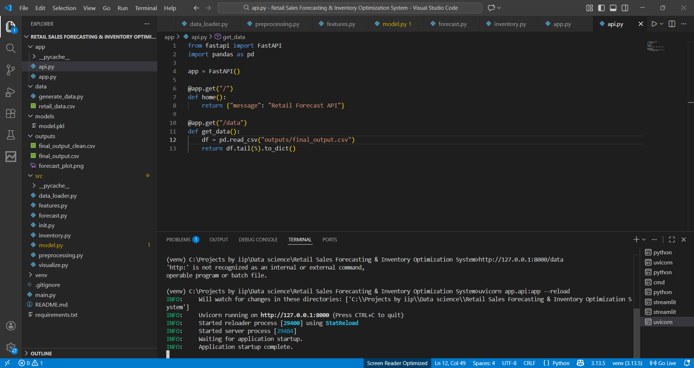
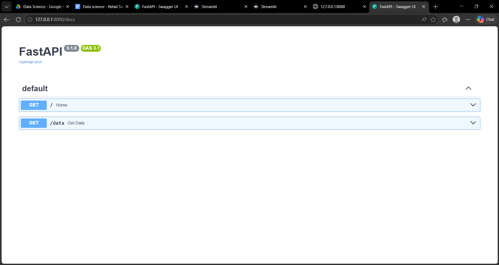
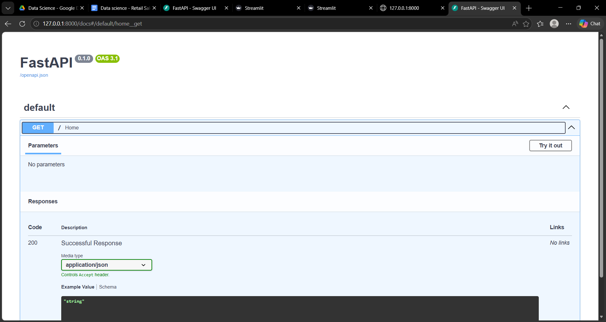
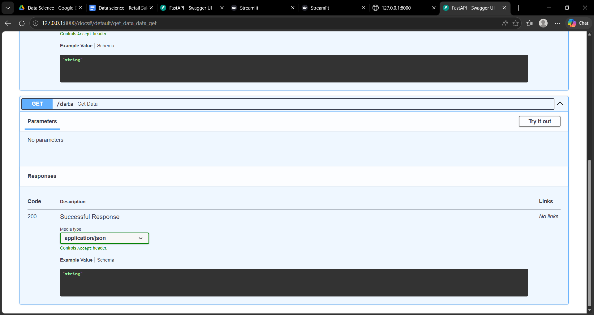

# 🛒 Retail Sales Forecasting & Inventory Optimization System

## 📌 Overview
This project is an end-to-end **Machine Learning + Business Analytics system** that predicts retail sales and optimizes inventory decisions.

It simulates a real-world retail environment where businesses must balance **demand forecasting** and **stock management** to avoid stockouts and overstocking.

---

## 🎯 Problem Statement
Retail businesses often struggle with:
- ❌ Stockouts → Lost sales
- ❌ Overstocking → Increased holding costs

This system solves these problems by:
- Forecasting future demand
- Recommending optimal inventory levels

---

## 💡 Key Features

✅ Sales Forecasting using Machine Learning (XGBoost)  
✅ Multi-store & multi-product support  
✅ Inventory Optimization (Safety Stock, Reorder Point, Order Quantity)  
✅ Interactive Dashboard using Streamlit  
✅ API Integration using FastAPI  
✅ End-to-End Pipeline (Data → Model → Business Logic → Output)

---

## 🧠 Tech Stack

- Python
- Pandas & NumPy
- Scikit-learn / XGBoost
- Matplotlib & Seaborn
- Streamlit
- FastAPI

---

## 🏗️ Project Architecture
Data → Preprocessing → Feature Engineering → ML Model → Forecast → Inventory Logic → Dashboard/API

---

## 📊 Dashboard Preview

## 📈 Forecast vs Actual

---

## 🔌 API Documentation

---

## 📂 Project Structure
Retail-Forecasting-System/
│
├── data/
├── src/
├── app/
├── models/
├── outputs/
├── images/
├── main.py
├── requirements.txt
└── README.md